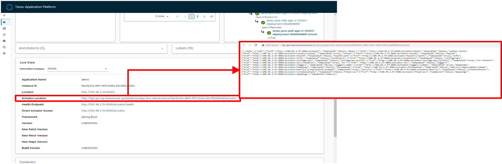
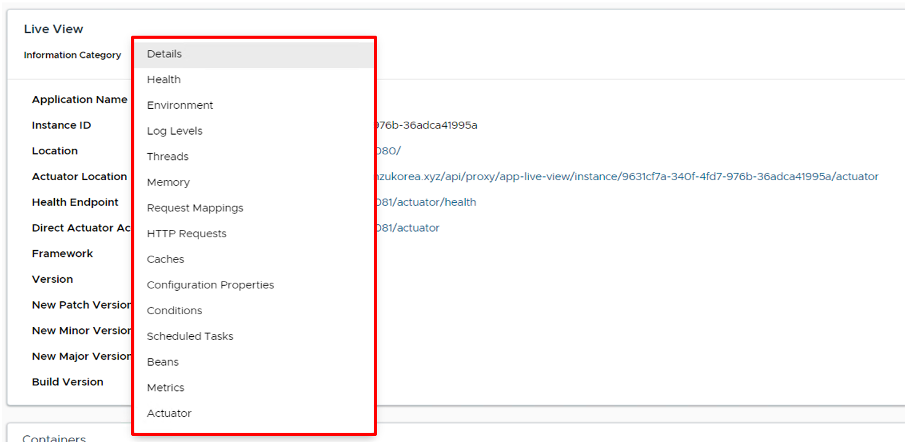
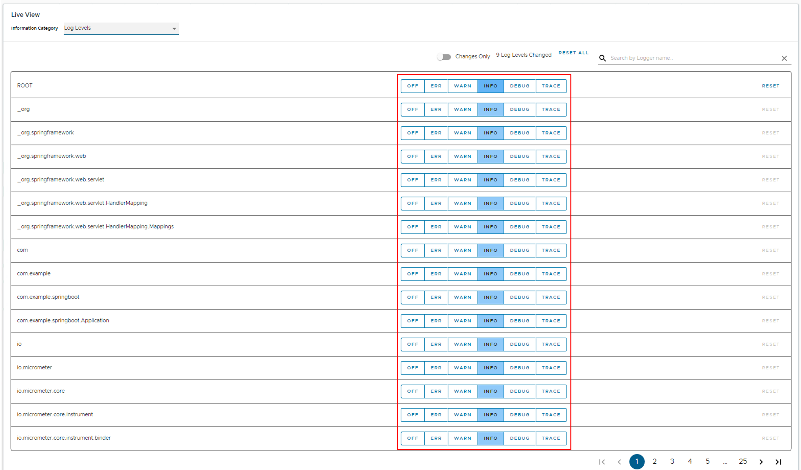
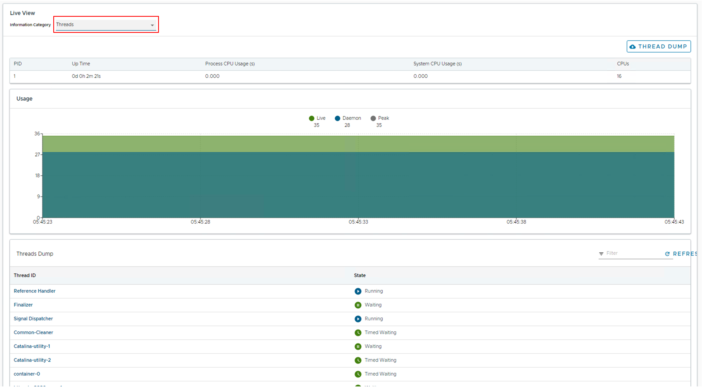
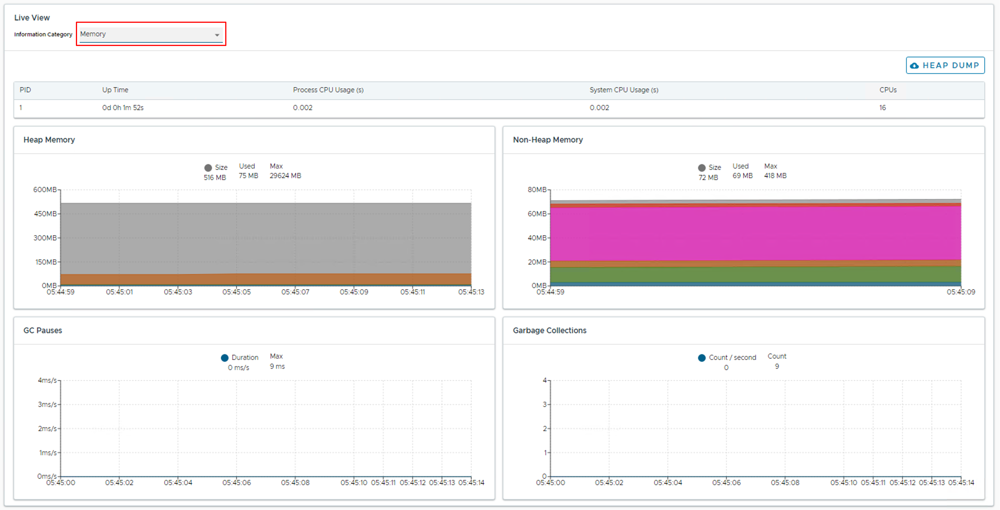

## Spring Boot 앱의 Application Live View 확인하기

이번 실습에서는 Spring Boot 앱에서 개발자들에게 제공되는 Actuator를 기반으로 한 정보들을 TAP에서 효과적으로 보여줄 수 있는 방법에 대해 소개합니다.

### Application Live View
Application Live View는 "Runtime Resources" 탭에서 Spring Boot 애플리케이션으로 구동된 Pod에 대한 정보를 조회할 때 보여지는 화면입니다.

Spring Boot 애플리케이션의 경우 다음과 같은 화면을 볼 수 있습니다. Actuator Location에 표시되는 링크를 클릭하면, Actuator가 제공하는 여러 정보들에 대한 링크를 확인할 수 있습니다. 

Information Category 셀렉트 박스를 클릭하면, Actutor가 제공하는 다양한 정보에 대한 목록을 보여줍니다.

#### Log Levels
Log Levels 항목에서는 애플리케이션에서 사용하는 스프링 기반의 프레임워크의 패키지 별 로그에 대해 레벨을 설정할 수 있습니다. 

#### Threads
Threads 항목에서는 쓰레드에 대한 정보 및 Thread Dump를 추출할 수 있습니다.

#### Memory
Memory 항목에서는 현재 구동되어 있는 Pod에 대한 메모리 정보 및 Garbage 정보를 조회할 수 있습니다.

#### HTTP Requests
HTTP Requests 항목에서는 Pod에 요청된 요청 수에 대한 정보를 그래프로 보여줍니다.

