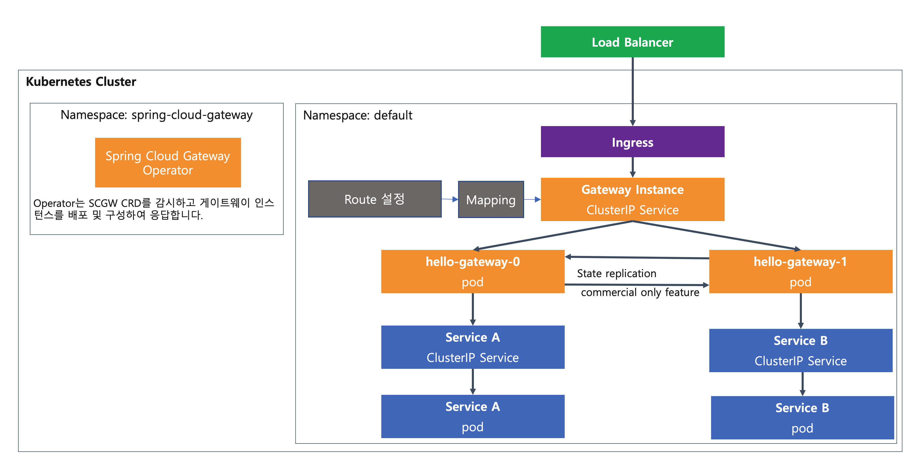
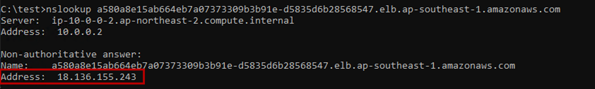
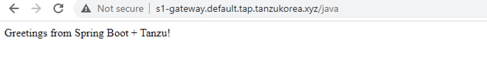

## Spring Cloud Gateway 구성하기
SCG (Spring Cloud Gateway)는 Engine역할을 하는 Operator가 설치가 되고, Gateway별로 인스턴스를 만들 수 있습니다.

SCG는 3개의 구성요소로 되어 있는데, 실제 Routing설정은 RouteConfig에 들어가 있고, Mapping은 Gateway 인스턴스와의 연결 설정이 들어 있습니다.

Gateway - Mapping - RouteConfig

전체적인 아키텍처 구성은 아래와 같습니다.




### 0. 시작 전 주의사항
아래 spring cloud gateway의 설정 중 숫자가 들어가는 부분은 본인이 할당받은 id 숫자를 사용합니다. 실습생들끼리 워크로드가 섞이지 않도록 워크로드 명을 주의해서 작성합니다. <br/>


### 1. Gateway 생성하기

Gateway 를 생성하기 위해 아래의 내용으로 파일을 하나 생성합니다.
spec이하의 내용은 테스트 용도로 리소스를 적게 사용하기 위해 설정한 것으로 실제 운영을 위해서는 충분한 메모리와 cpu를 할당하는 것을 권고합니다. 아무것도 설정하지 않은 default 값의 경우에는 (요청: 1 cpu/1GB, 최대: 2 cpu/2GB) 로 설정됩니다.

scg-gateway.yaml 
```
apiVersion: "tanzu.vmware.com/v1"
kind: SpringCloudGateway
metadata:
  name: s1-gateway
spec:
  resources:
    requests:
      cpu: "10m"
      memory: "500Mi"
    limits:
      cpu: "500m"
      memory: "1000Mi"
```
생성한 파일을 실행합니다.
```
kubectl apply -f scg-gateway.yaml
```

### 2. routing config 설정하기

route-config.yaml 을 아래의 내용으로 생성합니다.
routing 설정이 들어가는 가장 핵심적인 부분으로 CRD(Custom Resource)로 관리되므로, 설정을 변경하면 동적으로 변경사항이 반영됩니다.

아래의 설정은 /java/로 요청을 하게 되면 기존에 생성한 내부 서비스의 이름을 직접 넣어서 routing을 해주게 됩니다.
외부 URL로도 연동이 가능합니다.

```
apiVersion: "tanzu.vmware.com/v1"
kind: SpringCloudGatewayRouteConfig
metadata:
  name: s1-gateway-routes
spec:
  routes:
    - uri: http://tanzu-java-web-app-s1.default.tap.tanzukorea.xyz/
      predicates:
        - Path=/java/**
      filters:
        - StripPrefix=1
```

route 설정을 적용합니다.
```
kubectl apply -f route-config.yaml
```

### 3. mapping 설정하기
이제 위에서 만든 route-config와 gateway를 연결하는 mapping설정을 하면 됩니다.
아래의 내용으로 mapping.yaml을 생성합니다.

```
apiVersion: "tanzu.vmware.com/v1"
kind: SpringCloudGatewayMapping
metadata:
  name: s1-gateway-mapping
spec:
  gatewayRef:
    name: s1-gateway
  routeConfigRef:
    name: s1-gateway-routes
```

mapping 파일을 적용합니다.
```
kubectl apply -f mapping.yaml
```

### 4. Ingress 설정하기
기본적으로 Gateway는 ClusterIP로 동작하기 때문에 Ingress를 별도로 설정을 해주어야 합니다.
TKG에서는 Contour를 기본적으로 사용하므로 Contour를 사용하는 것을 바탕으로 합니다.

ingress.yaml 설정을 아래와 같이 합니다.
```
apiVersion: networking.k8s.io/v1
kind: Ingress
metadata:
  name: s1-gateway-ingress
  annotations:
    kubernetes.io/ingress.class: contour
spec:
  rules:
    - host: s1-gateway.default.tap.tanzukorea.xyz
      http:
        paths:
          - path: /
            pathType: Prefix
            backend:
              service:
                name: s1-gateway
                port:
                  number: 80
```

여기에서 host이름은 TKG에서 사용하는 도메인이 있는 경우에는 해당 도메인을 넣으시면 됩니다. Test로 하는 경우에는 가상으로 임의의 주소를 입력을 하고, client의 pc의 /etc/hosts 파일에 URL주소와 ingress로 생성되는 외부ip를 넣으시면 됩니다.

```
kubectl apply -f ingress.yaml
```

### 5. 서비스 확인하기
생성된 ingress의 ip를 확인합니다.
```
$ kubectl get ingress
NAME                    CLASS    HOSTS                                   ADDRESS                                                                              PORTS   AGE
s1-gateway-ingress      <none>   s1-gateway.default.tap.tanzukorea.xyz   a580a8e15ab664eb7a07373309b3b91e-d5835d6b28568547.elb.ap-southeast-1.amazonaws.com   80      30s
```

이 ingress address에 해당하는 실제 IP는 cmd에서 nslookup을 통해 조회합니다. 

해당 IP (18.136.155.243) 를 기록합니다.

로컬 pc의 /etc/hosts 파일에 IP를 추가합니다.


브라우저에서 http://s1-gateway.default.tap.tanzukorea.xyz/java로 호출해 연결을 확인합니다.


<br/><br/>
본 Lab을 성공적으로 마치셨습니다.

