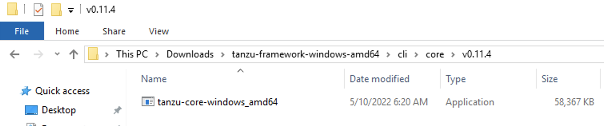
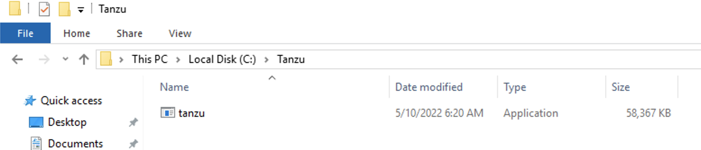
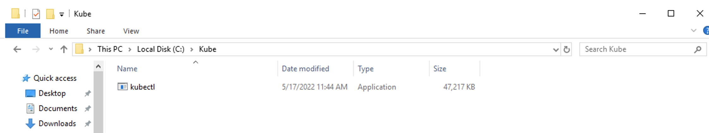
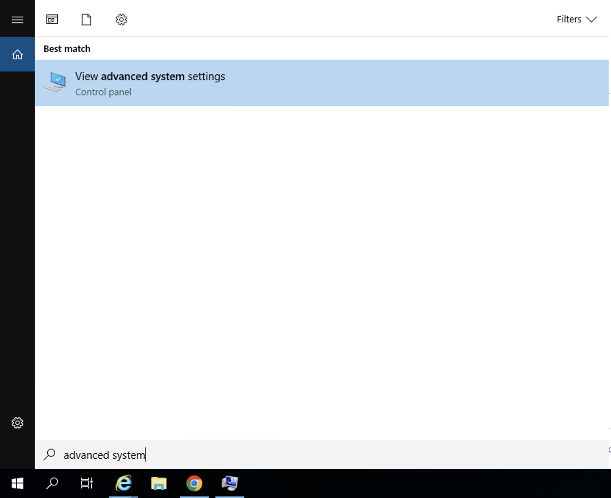
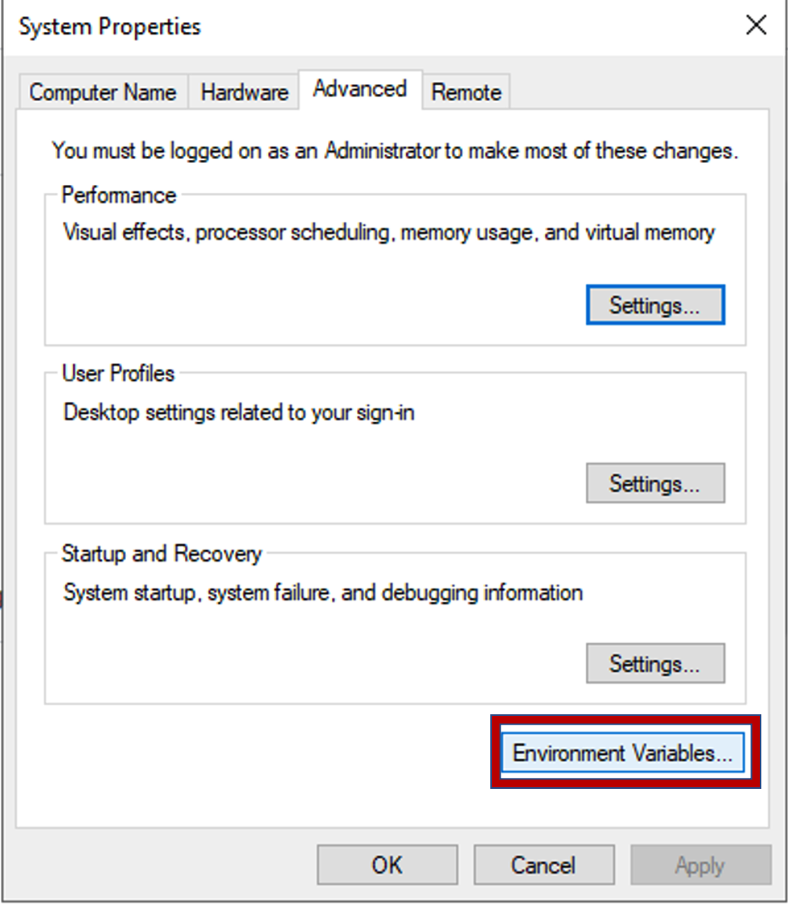
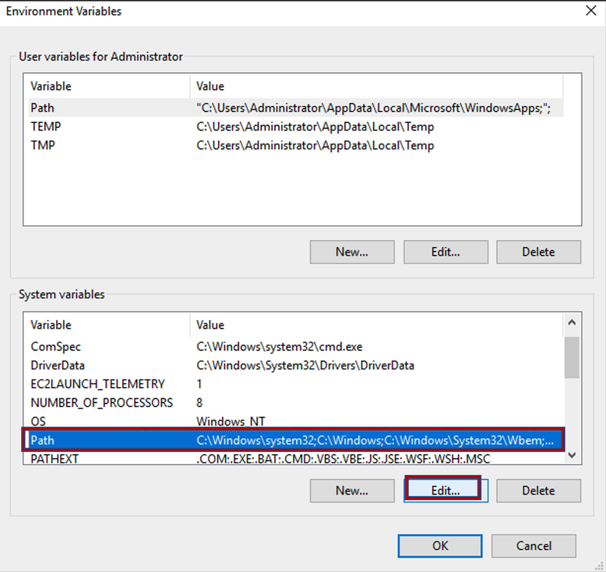
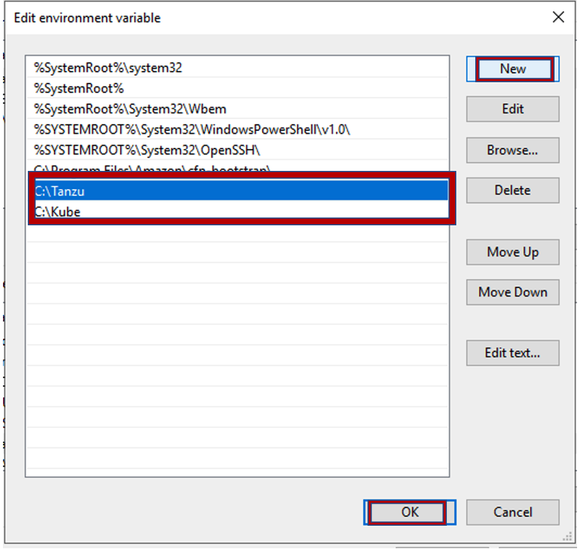
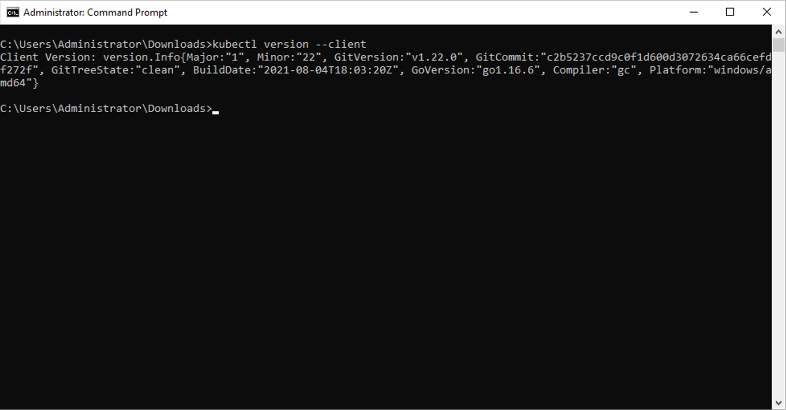
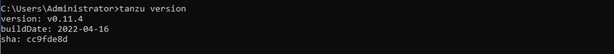

## 실습 환경 체크
다음의 파일들이 설치되어 있는지 확인합니다.
* SSH 도구: Putty
* Tanzu CLI
* kubectl CLI
* VSCode IDE 및 TAP용 Plugin

***참고 : 본 Lab은 Windows OS 기준으로 진행됩니다.**

### 0. 파일 준비
https://drive.google.com/drive/folders/1-z8_jvzTQd6FrGiGkFO5nyKsNA54l1ku 에서 필요한 파일들을 다운받습니다.

### 1. Putty 설치
**0. 파일 준비** 에서 다운받은 putty를 클릭해 실행을 확인합니다.

### 2. Tanzu CLI 준비
**0. 파일 준비** 에서 받은 Tanzu CLI를 Windows 환경 변수에 추가하는 과정입니다.

다운받은 Tanzu CLI 파일 **(tanzu-framework-windows-amd64)** 의 압축을 해제합니다.  
압축 해제 후 cli/core/v0.11.4 로 이동하면 tanzu-cre-windows_amd64 파일을 확인할 수 있습니다.  

이 파일을 tanzu로 이름 변경 후 (추후 알기 쉽도록), C 드라이브 아래에 tanzu 라는 디렉토리를 생성하고 이곳으로 이동시킵니다.   

 

이후 설치 과정은 **4. Tanzu CLI 및 Kubectl 설치** 에서 한번에 진행합니다.  

### 3. kubectl CLI 준비
**0. 파일 준비** 에서 받은 Kubectl을 Windows 환경 변수에 추가하는 과정입니다.

C 드라이브 아래에 Kube라는 디렉토리를 생성하고, 다운받은 Kubectl 파일을 이곳으로 이동시킵니다.  

 

이후 설치 과정은 **4. Tanzu CLI 및 Kubectl 설치** 에서 한번에 진행합니다.  

### 4. Tanzu CLI 및 Kubectl 설치
Windows 키를 눌러 Advanced System Setting을 검색합니다. 

창 맨 아래의 Environment Variables를 클릭합니다. 

Path를 선택 후 Edit을 클릭합니다. 

NEW 클릭 -> C:\Tanzu 와 C:\Kube를 입력하고, OK 버튼을 클릭합니다. **처음에 열었던 Advanced System Setting 창이 닫힐 때 까지 OK를 클릭** 합니다. 

cmd로 이동해 kubectl version을 입력해 kubectl 설치를 확인합니다.

마찬가지로 cmd에서 tanzu version을 입력해 tanzu cli 설치를 확인합니다.

### 5. VSCode IDE 및 TAP용 Plugin 설치

#### 1) VSCode IDE 설치

#### 2) TAP용 Plugin 설치

