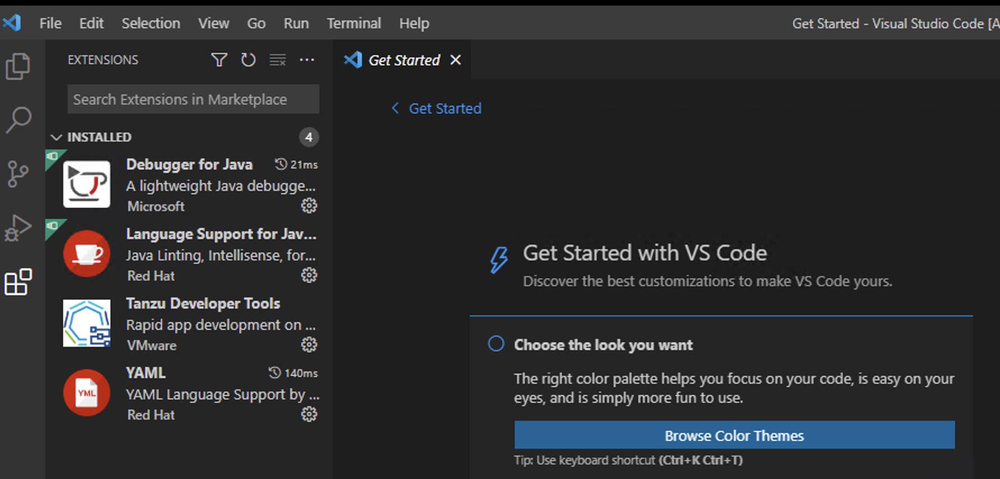

## 실습 환경 체크
다음의 파일들이 설치되어 있는지 확인합니다.
* SSH 도구: Putty
* Tanzu CLI
* kubectl CLI
* VSCode IDE 및 TAP용 Plugin

설치되지 않은 구성요소가 있을 경우, [환경 구성](docs/configure.md) 으로 이동합니다.

***참고 : 본 Lab은 Windows OS 기준으로 진행됩니다.**


### 1. Putty
putty가 설치되었는지 확인합니다. <br/>

### 2. Tanzu CLI
다음 커맨드를 실행해 accelerator, apps, package, secret, services plugin이 모두 설치되었는지 확인합니다.
```
tanzu plugin list
```
 <br/>

### 3. Kubectl CLI
cmd에서 kubectl version을 입력해 kubectl 설치를 확인합니다.


### 4. VScode IDE 및 TAP용 Plugin
VSCode를 열어 extension에 Tanzu Developer Tools이 설치되었는지 확인합니다.



실습 환경 체크 Lab을 성공적으로 마치셨습니다.

