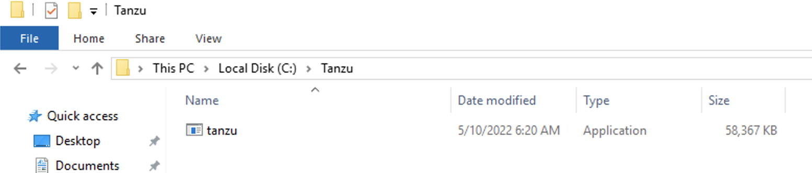
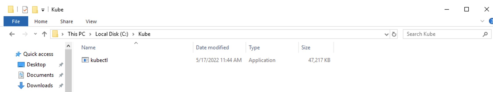
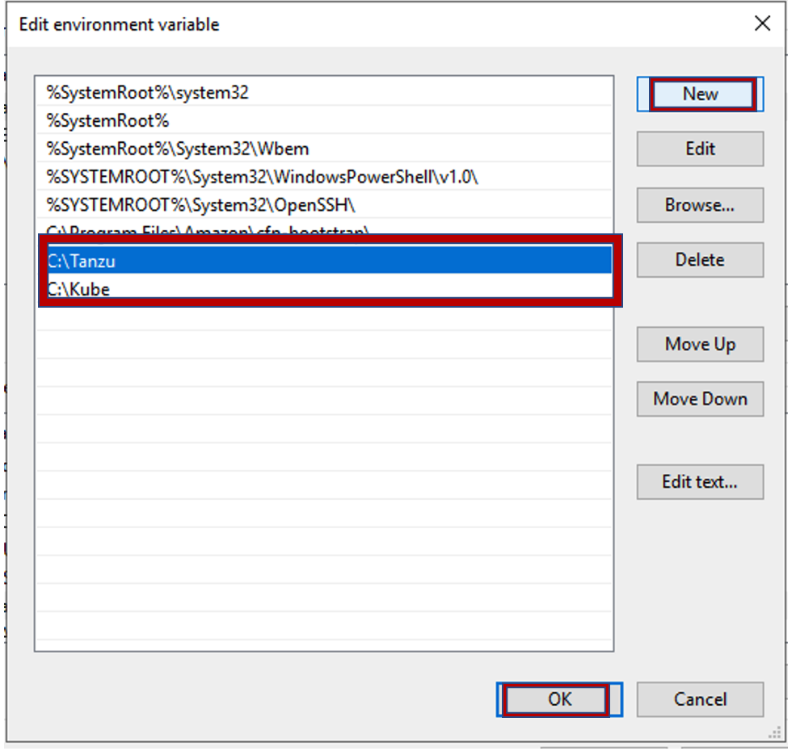
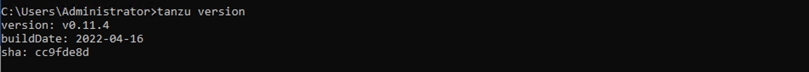

## 환경 구성
이번 Lab에서는 Tanzu Application Platform을 위한 환경을 구성하겠습니다.

* Tanzu CLI
* kubectl CLI
* VSCode IDE 및 TAP용 Plugin
* Tanzu Kubernetes Cluster

***참고 : 본 Lab은 Windows OS 기준으로 진행됩니다.**

### 0. 파일 준비
https://drive.google.com/drive/folders/1-z8_jvzTQd6FrGiGkFO5nyKsNA54l1ku 에서 파일들을 다운로드 합니다.

### 1. Tanzu CLI 준비
다운로드 받은 Tanzu CLI를 Windows 환경 변수에 추가합니다.

다운받은 Tanzu CLI 파일 **(tanzu-framework-windows-amd64)** 의 압축을 해제합니다. 

C:\Program Files 아래에 Tanzu 라는 폴더를 생성합니다.
압축을 해제한 후 생긴 cli 폴더를 이곳에 붙여넣기합니다.


cli/core/v0.11.4 로 이동하면 tanzu-cre-windows_amd64 파일을 확인할 수 있습니다. 


이 파일을 tanzu로 이름 변경 후 (추후 알기 쉽도록), C 드라이브 아래에 tanzu 라는 디렉토리를 생성하고 이곳으로 복사합니다.


이후 설치 과정은 **3. Tanzu CLI 및 Kubectl 설치** 에서 한번에 진행합니다.

### 2. kubectl CLI 준비
다운로드받은 kubectl을 Windows 환경 변수에 추가합니다.

C 드라이브 아래에 Kube라는 디렉토리를 생성하고, 다운받은 Kubectl 파일을 이곳으로 이동시킵니다. 


이후 설치 과정은 **3. Tanzu CLI 및 Kubectl 설치** 에서 한번에 진행합니다. 

### 3. Tanzu CLI 및 kubectl CLI 설치
Windows 키를 눌러 Advanced System Setting을 검색합니다.


창 맨 아래의 Environment Variables를 클릭합니다.


<br/>
Path를 선택 후 Edit을 클릭합니다.


NEW 클릭 -> C:\Tanzu 와 C:\Kube를 입력하고, OK 버튼을 클릭합니다. **처음에 열었던 Advanced System Setting 창이 닫힐 때 까지 OK를 클릭** 합니다.<br/>


cmd로 이동해 kubectl version을 입력해 kubectl cli 설치를 확인합니다.
```
kubectl version --client
```


마찬가지로 cmd에서 tanzu version을 입력해 tanzu cli 설치를 확인합니다.
```
tanzu version
```


tanzu cli 설치를 마치기 위해, cli 폴더가 있는 C:\Program Files\Tanzu 로 이동합니다.
아래 커맨드를 실행하면 필요한 cli가 설치됩니다. <br/>
```
tanzu plugin install --local cli all
```
아래 캡쳐와 같이 successfully installed 메시지를 확인합니다.


다음 커맨드를 실행해 accelerator, apps, package, secret, services plugin이 모두 설치되었는지 확인합니다.
```
tanzu plugin list
```


<br/>


### 4. Tanzu Kubernetes Cluster 설치
cmd 창에서 C:\Users\Administrator로 이동해 .kube 디렉토리를 생성합니다.
```
mkdir .kube
```
Downloads 폴더에 있는 config 파일을 방금 생성한 .kube 디렉토리로 이동시킵니다.


kubectl cluster-info 커맨드를 실행해 cluster정보를 확인합니다. 이후 kubectl get ns를 확인해 설치된 네임스페이스 들을 확인합니다.


환경 구성 Lab을 성공적으로 마치셨습니다.

