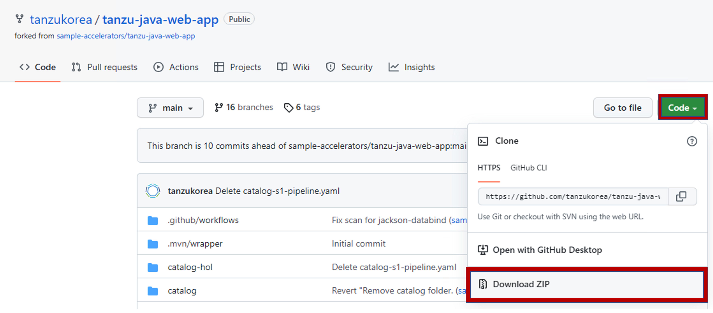
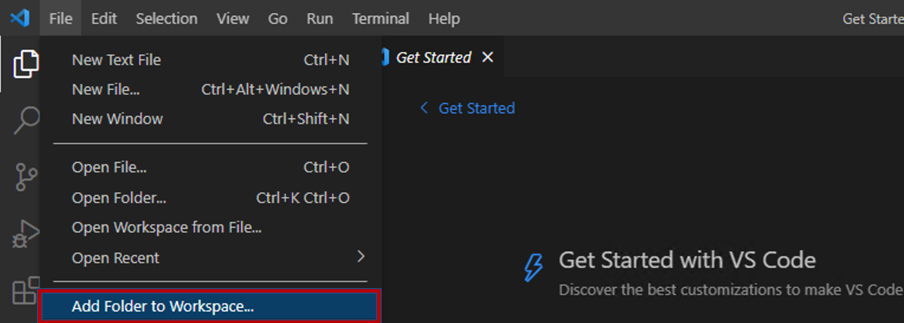
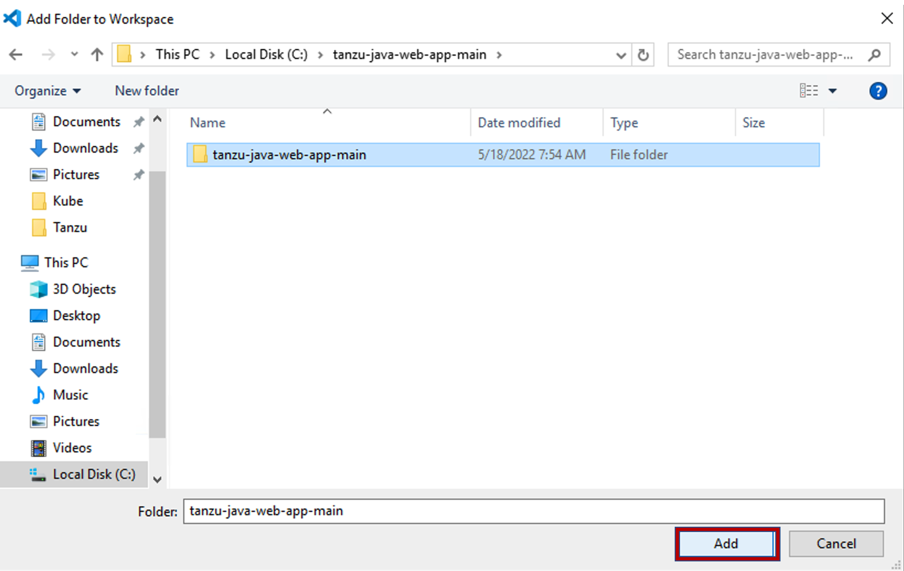
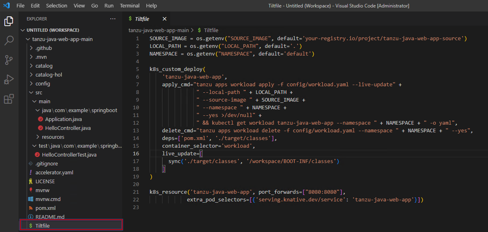
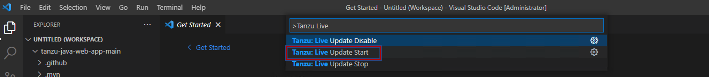

## IDE에서 APP 동적 배포하기
본 과정에서는 IDE (VSCode)를 이용하여 쉽게 애플리케이션을 동적으로 배포하는 방법에 대해 학습합니다.

### 1. 소스코드 준비
https://github.com/tanzukorea/tanzu-java-web-app 에 접속해 소스 코드를 다운받습니다.

파일 압축을 해제하고, Visual Studio Code를 열어 다운받은 파일의 디렉토리를 불러옵니다.

### 2. Live Update 실행
Live Update를 구동시키면 Tiltfile이 구동됩니다. tanzu-java-web-app-main 디렉토리 하위에 있는 Tiltfile을 확인합니다.

ctrl + Shift + P를 누르면 명령어 팔레트 창이 뜹니다. 여기서 Tanzu: Live Update Start를 클릭합니다.

