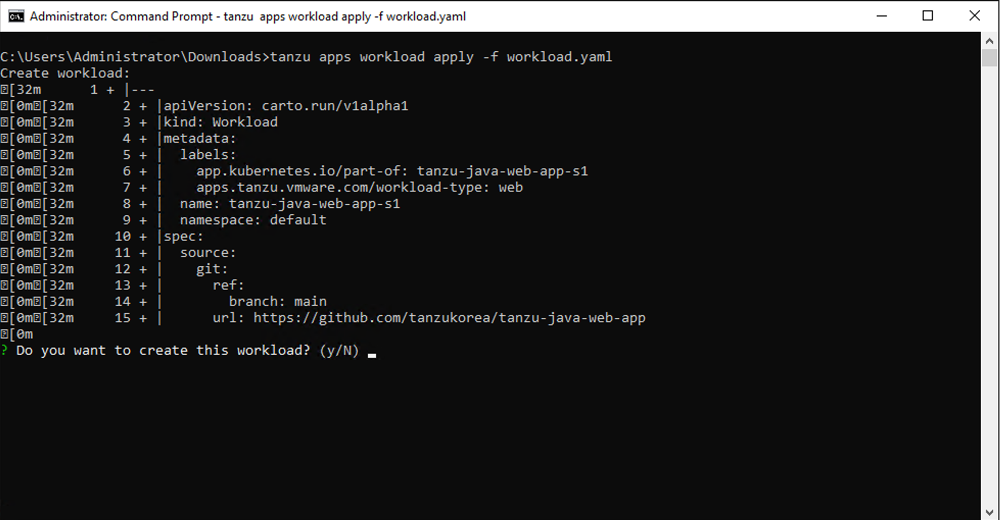
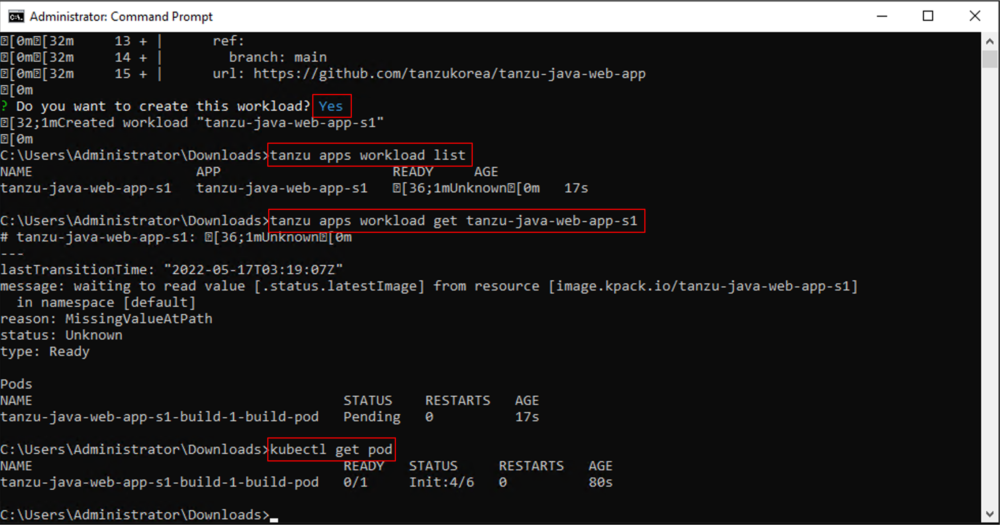
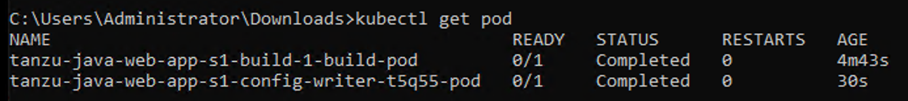
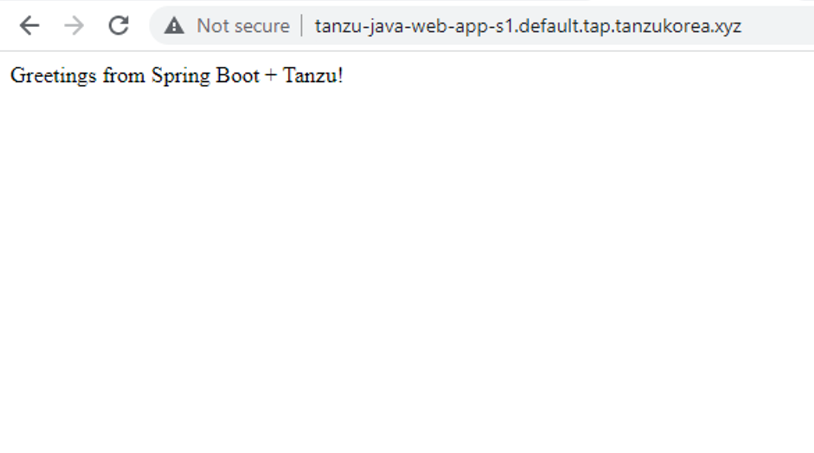
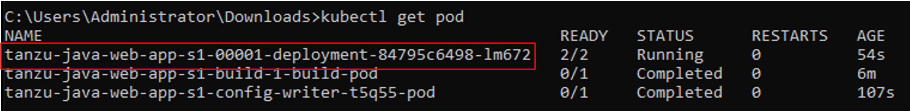

## TAP를 이용해서 APP 배포하기

본 과정에서는 TAP (Tanzu Application Platform)를 이용하여 쉽게 애플리케이션을 배포하는 방법에 대해 학습합니다.
원활한 실습을 위하여 사용자 별로 생성할 애플리케이션 명은 다음과 같이 명명합니다. 붉은색으로 되어 있는 부분을 자신의 번호에 맞게 수정합니다.

애플리케이션 명: tanzu-java-web-app-<span style="color: red">s1</span>

### 1. 워크로드 파일 생성
다음과 같이 2가지 방법으로 TAP를 이용하여 워크로드를 생성할 수 있습니다.
* tanzu CLI를 이용하여 생성
* workload 파일을 이용하여 생성

여기서는 workload 파일을 작성하여 워크로드를 생성하는 방법으로 랩을 진행합니다.
앱 소스는 git에서 가져온다고 가정하고, 다음과 같이 workload.yaml 파일을 생성합니다. <span style="background-color: #fff5b1">실습생들끼리 워크로드가 섞이지 않도록 워크로드 명을 주의해서 작성합니다.</span>

```yaml
apiVersion: carto.run/v1alpha1
kind: Workload
metadata:
  name: tanzu-java-web-app-s1
  labels:
    app.kubernetes.io/part-of: tanzu-java-web-app-s1
    apps.tanzu.vmware.com/workload-type: web

spec:
  source:
    git:
      url: https://github.com/tanzukorea/tanzu-java-web-app
      ref:
        branch: main
```

### 2. 앱 배포
워크로드 파일을 생성한 후 tanzu 명령어로 워크로드를 생성합니다.
```cmd
tanzu apps workload apply -f workload.yaml
```

> 워크로드를 CLI를 이용해서 생성하고 싶은 경우 아래와 같은 명령어를 사용하시면 됩니다. 아래 명령어는 위에서 작성한 workload.yaml 파일을 실행했을 때와 동일한 앱을 생성하는 명령어 입니다. <span style="background-color: #fff5b1">(워크로드 명 확인)</span>

```cmd
tanzu apps workload create tanzu-java-web-app-s1 \
--git-repo https://github.com/sample-accelerators/tanzu-java-web-app \
--git-branch main \
--type web \
--label app.kubernetes.io/part-of=tanzu-java-web-app-s1 \
--yes
```


위와 같은 출력이 나타나면 "y" 를 입력하고 계속해서 워크로드 생성을 진행합니다.


### 3. 로그 확인
이제 워크로드가 잘 생성되고 있는지 다음 명령어를 이용해서 확인해 봅니다.
> 워크로드 목록 조회
```cmd
tanzu apps workload list
```

> 방금 생성한 "tanzu-java-web-app-<span style="color: red">s1</span>" 워크로드 조회 <span style="background-color: #fff5b1">(워크로드 명 확인)</span>
```cmd
tanzu apps workload get tanzu-java-web-app-s1
```

TAP에서 수행되는 모든 행위들은 pod 기반으로 작동됩니다. git에서 참조하는 애플리케이션 소스를 기반으로 빌드를 수행해 주는 pod가 실행되고 있음을 알 수 있습니다. 
```cmd
kubectl get pod
```
다음과 같은 화면이 출력될 것입니다.


빌드 pod 안에서 구동되는 여러 컨테이너들이 순차적으로 작업을 수행하게 되고, 이 작업이 완료되기까지 약 5~10분 정도 소요됩니다. 

모든 작업이 완료되고 나면 pod 조회 시 다음과 같은 화면이 출력됩니다.
```cmd
kubectl get pod
```


워크로드가 실행될 애플리케이션 파드가 보이지 않습니다. TAP가 생성한 pod들은 knative (serverless) 기반이기 때문에, 실제 호출이 일어나지 않으면 pod가 생성되지 않습니다. 

이제 앱을 호출해 보도록 하겠습니다.

URL: http://tanzu-java-web-app-<span style="color: red">s1</span>.default.tap.tanzukorea.xyz/

웹페이지는 아래와 같이 나타나게 됩니다.
{: width="80" height="80"}

이제 pod를 조회하여 실제 애플리케이션 pod가 생성되었는지를 확인합니다.
```cmd
kubectl get pod
```


### 4. 그 밖의 tanzu 명령어
> 워크로드 삭제
```cmd
tanzu apps workload delete tanzu-java-web-app-s1
```

> 기타 Tanzu CLI 참조

https://docs.vmware.com/en/Tanzu-Application-Platform/1.1/tap/GUID-cli-plugins-apps-command-reference.html
