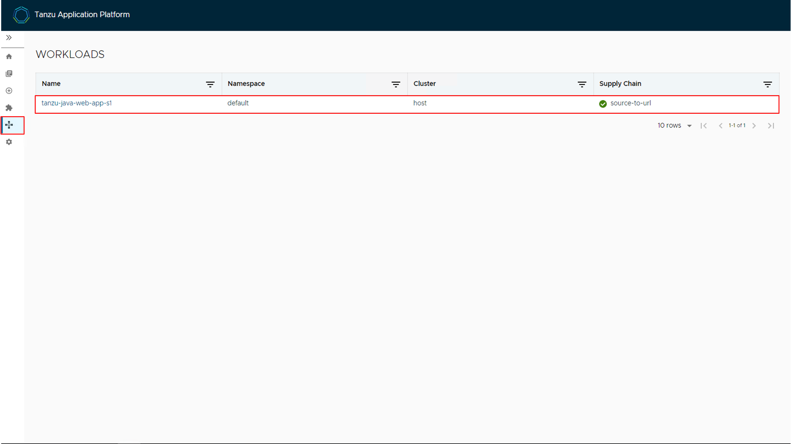
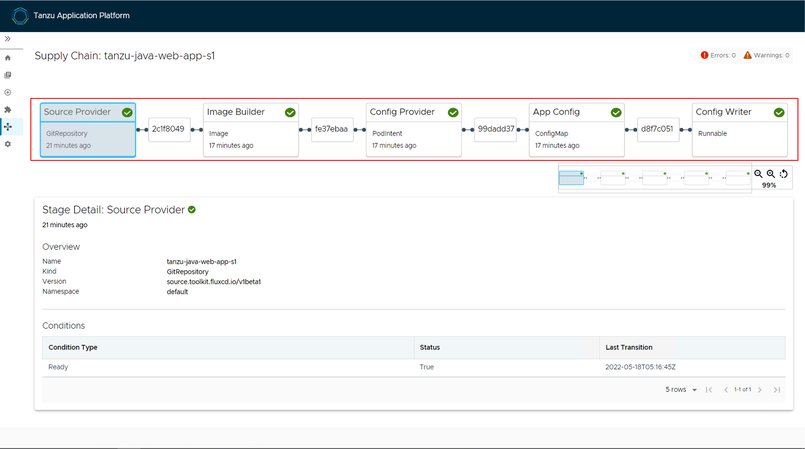
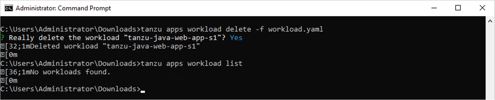
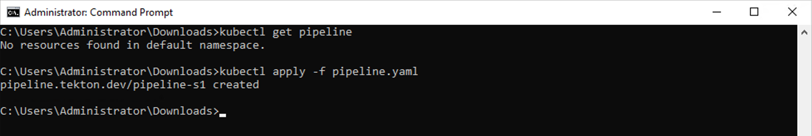
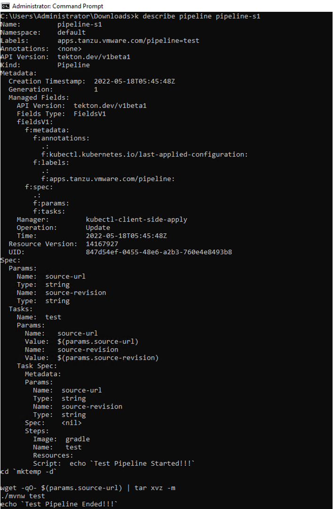
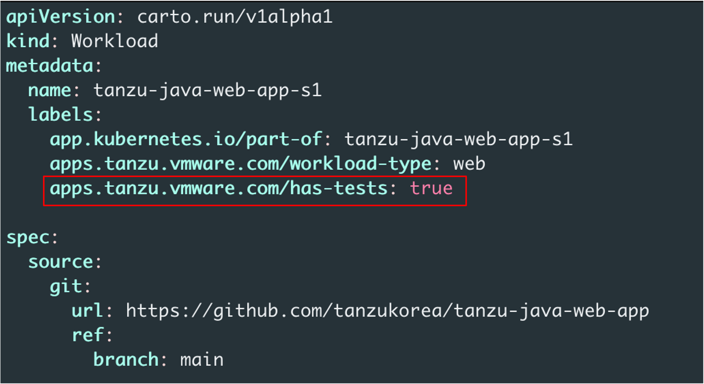
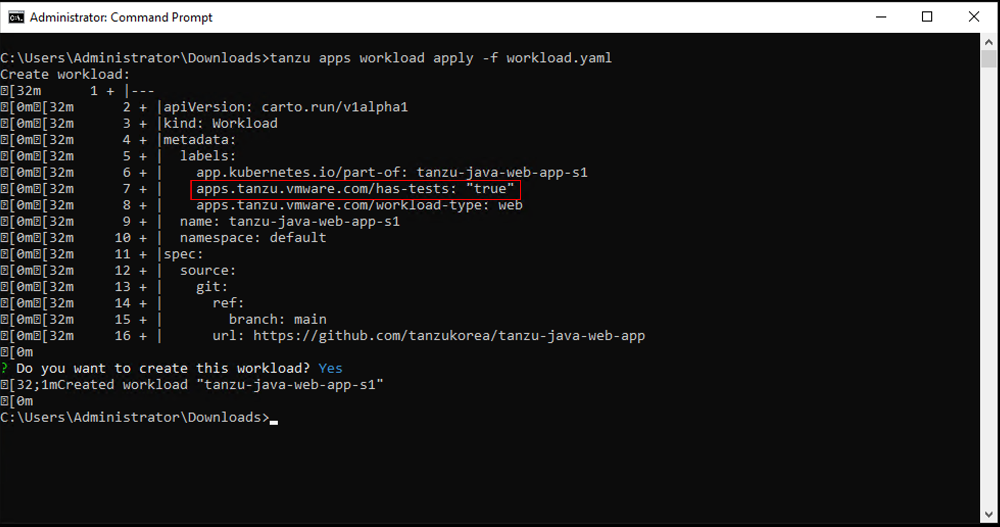
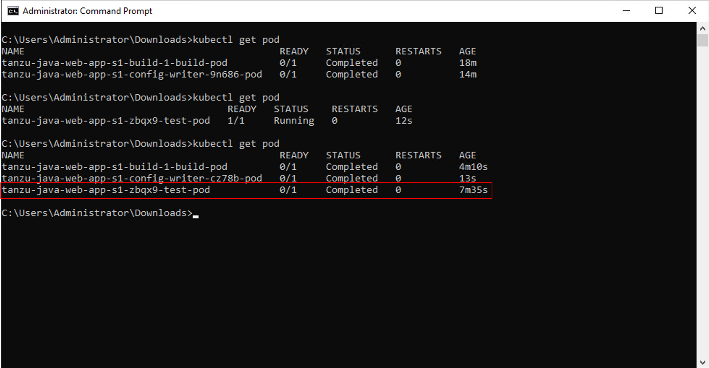
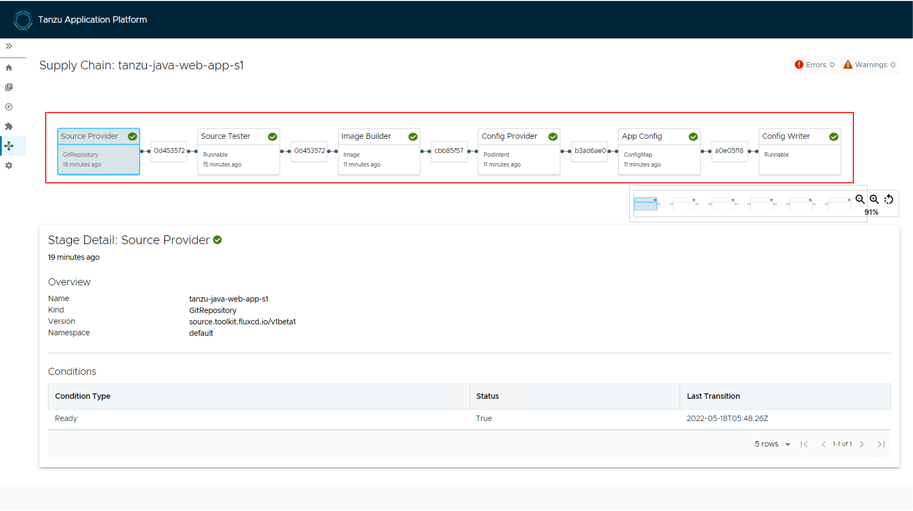
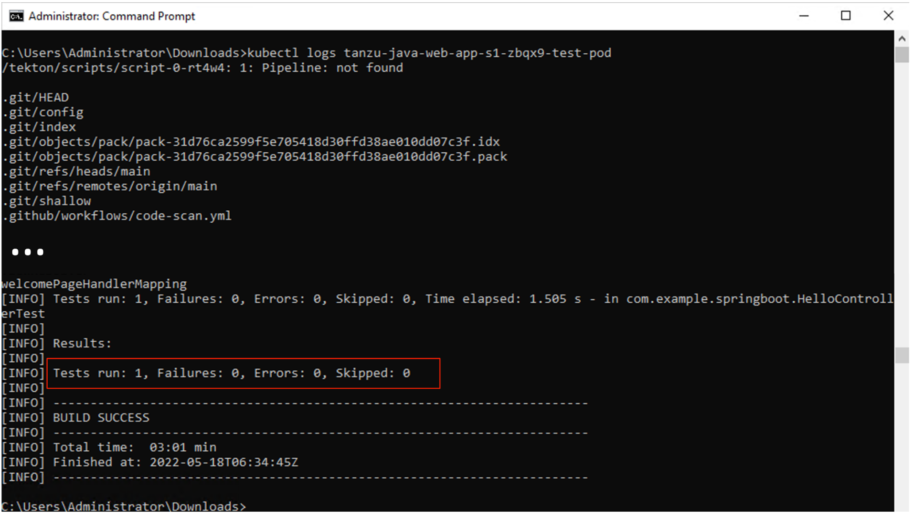

## 파이프라인 추가
이번 실습에서는 TAP에서 기본적으로 제공하는 파이프라인에 소스 파일을 테스트하는 기능을 추가해 보겠습니다.

### 1. 기존 워크로드 파이프라인 확인
기본적으로 제공되는 파이프라인과의 비교를 위하여, 기존에 생성했던 워크로드의 파이프라인을 확인합니다. 

URL: http://tap-gui.tap.tanzukorea.xyz/

TAP GUI에 접속하고 아래와 같이 좌측의 워크로드 메뉴를 클릭합니다. 워크로드 메뉴가 나타나면 내가 생성한 워크로드 명을 확인하고 클릭합니다.


파이프라인을 확인합니다. 기본적으로 제공되는 파이프라인은 애플리케이션을 빌드하고 쿠버네티스 클러스터에 배포하는 로직만 구성되어 있음을 알 수 있습니다.


### 2. 워크로드 삭제

이제 새로운 워크로드의 파이프라인을 적용하기 위해 다음의 명령어를 사용하여 기존 워크로드를 삭제합니다. 다음 두 명령어 중 한 가지 명령어를 사용하여 워크로드를 삭제할 수 있습니다.
```
tanzu apps workload delete -f workload.yaml
```
혹은
```
tanzu apps workload delete tanzu-java-web-app-s1
```

워크로드가 잘 삭제되었는지 확인하기 위해 다음 명령어를 통해 현재 워크로드를 조회합니다.
```
tanzu apps workload list
```

다음과 같이 워크로드가 존재하지 않음을 확인합니다.


### 3. 테스트를 Pipeline에 추가
이제 신규로 파이프라인을 추가하기 전에 다음 명령어를 이용하여 기존의 파이프라인이 존재하는지 확인합니다.
```
kubectl get pipeline
```

파이프라인이 존재하지 않음을 확인하고, 신규 파이프라인을 작성합니다. 먼저 pipeline.yaml이라는 파일 이름은 파일을 생성하고 다음과 같이 입력해 줍니다. 파이프라인 명 역시 자신의 s# 번호에 유의하여 지정해 줍니다.
```
apiVersion: tekton.dev/v1beta1
kind: Pipeline
metadata:
  name: pipeline-s1
  labels:
    apps.tanzu.vmware.com/pipeline: test     # (!) required
spec:
  params:
    - name: source-url                       # (!) required
    - name: source-revision                  # (!) required
  tasks:
    - name: test
      params:
        - name: source-url
          value: $(params.source-url)
        - name: source-revision
          value: $(params.source-revision)
      taskSpec:
        params:
          - name: source-url
          - name: source-revision
        steps:
          - name: test
            image: gradle
            script: |-
              cd `mktemp -d`

              wget -qO- $(params.source-url) | tar xvz -m
              ./mvnw test
```

pipeline.yaml 파일이 생성되었으면, 다음의 명령어를 수행하여 파이프라인을 생성합니다.
```
kubectl apply -f pipeline.yaml
```


다음과 같이 생성된 파이프라인의 정보를 확인합니다.
```
kubectl describe pipeline pipeline-s01
```


### 4. 테스트가 추가된 파이프라인을 적용하도록 워크로드 수정
기존에 생성했던 workload.yaml 파일을 열고 다음과 같이 "apps.tanzu.vmware.com/has-tests: true" 옵션을 추가해 줍니다.
```
apps.tanzu.vmware.com/has-tests: true
```


파일이 수정되었으면 워크로드를 생성하기 위해 다음 명령어를 수행하고, 수정한 옵션이 잘 적용되었는지 확인합니다.
```
tanzu apps workload apply -f workload.yaml
```



워크로드가 생성되었으면 파드 목록을 조회해 보면서 기존에 사용했던 파이프라인과의 차이점을 비교해 봅니다. 신규로 사용하는 파이프라인이 적용된 워크로드의 경우 아래와 같이 test를 수행하는 Pod가 추가로 생성된 것을 확인할 수 있습니다.


### 4. TAP GUI에서 파이프라인 확인
TAP GUI에 접속해서 신규 생성된 워크로드의 파이프라인을 확인합니다. 기존과 다르게 "Source Tester"가 추가된 것을 확인할 수 있습니다.


파이프라인에 추가된 테스트 기능이 정의된 방식대로 수행되었는지 확인하기 위해 테스트 Pod의 Pod 명을 조회합니다.
```
kubectl get pod
```

Pod 명을 확인하고 다음 명령어를 사용해서 해당 테스트 Pod의 로그를 확인합니다.
```
kubectl logs tanzu-java-web-app-s1-zbqx9-test-pod
```

다음과 같이 Maven에서 수행되는 테스트 명령어가 정상적으로 수행되었음을 확인합니다.

